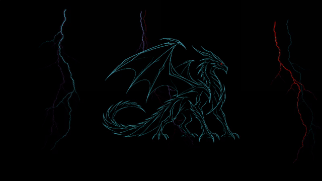

<p align="center">
  <a href="docs/media/draco-demo.mp4"></a>
</p>

<h1 align="center">DracoShell 🐉</h1>
<p align="center"><strong>Your terminal. A dragon. A little lightning.</strong></p>
<p align="center">An animated Windows Terminal theme for Windows PowerShell.<br>Lightning as you type. Fire when you hit Enter.</p>

<p align="center">
  <a href="https://github.com/lucatirel/DracoShell/actions/workflows/validate.yml"></a>
  <a href="LICENSE"></a>
  <a href="docs/DEPENDENCIES.md"></a>
  <a href="docs/ARCHITECTURE.md"></a>
</p>

<p align="center">
  <a href="#install"><strong>Install</strong></a> ·
  <a href="docs/media/draco-demo.mp4">Watch the demo</a> ·
  <a href="#controls">Controls</a> ·
  <a href="#spread-the-dragon">Spread the dragon</a>
</p>

A cyan outline dragon, a crimson eye and just enough movement to make your terminal
feel alive. Ambient storms slip behind the wings or flash in front; typing adds
thin green lightning, and Enter sends a short flame from the dragon's mouth.
Your prompt stays readable, with directory, Git and Python context.

<sub>The preview uses the actual shader rendered on Windows Direct3D WARP with simulated input. [Capture details](docs/media/README.md).</sub>

## Meet your terminal dragon

| You do this | Draco does this |
| --- | --- |
| **Type** | Thin green lightning flashes across the pane |
| Hit **Enter** | A red-orange flame travels from the mouth and fades away |
| Leave it **idle** | Gentle movement, a glowing eye and cyan/violet storms |
| **Resize or split** | The scene adjusts to each pane |
| Get **work done** | A compact two-line Oh My Posh prompt keeps the useful context close |

## Choose a dragon

One installer provides seven presets; no Git branch switch or uninstall is needed.
A bare install selects `lineart`, the cyan outline dragon shown in the demo.

| `-Dragon` | Appearance and effects |
| --- | --- |
| `lineart` (default) | Cyan outline, gentle movement, thin lightning and Enter fire |
| `public` | Earlier cyber dragon with a still body, lightning and fire |
| `subtle` | Stylized dragon with gentle body, wing and tail movement |
| `armored` | Layered armored dragon with flight and landing |
| `legacy-v2`, `legacy-v3`, `legacy-fx` | Historical ambient effects using public lineart artwork; no typing/fire bridge |

```powershell
# List choices without changing your installation:
powershell -NoProfile -File .\install.ps1 -ListDragons

# Switch graphics, then open a new Windows PowerShell tab:
powershell -NoProfile -ExecutionPolicy Bypass -File .\install.ps1 -Dragon subtle

# Return to the public default:
powershell -NoProfile -ExecutionPolicy Bypass -File .\install.ps1 -Dragon lineart
```

`-NoDragonMotion`, `-NoTypingEffects` and `-Static` can be combined with `-Dragon`.
An install without `-Dragon` returns to `lineart`, including after another preset.
[Pack details and adding a variant](docs/VARIANTS.md).

## Small by design

**One cached graphics atlas. No process launched per keystroke.**

The default lineart 3072 × 640 atlas is about **0.68 MiB on disk** and **7.5 MiB decoded**.
Effects reuse that texture, notifications stay bounded, and the bridge timer
stops when input effects finish. Choose full effects, ambient animation or a
static background in the installer. The armored pack uses a 4352 × 640 atlas
(about 10.625 MiB decoded); each tab renders only its selected pack.

The input bridge receives anonymous events, without reading characters or
commands. No global keyboard hook, clipboard reads or input logging.

[Architecture](docs/ARCHITECTURE.md) · [Animation](docs/ANIMATION.md) ·
[Security review](docs/SECURITY_REVIEW.md)

<sub>Atlas sizes describe one texture, not total Terminal memory. Live GPU usage and input latency have not been benchmarked.</sub>

## Install

Use **Windows PowerShell 5.1**. Review the scripts, then clone and install:

```powershell
git clone https://github.com/lucatirel/DracoShell.git
if ($LASTEXITCODE -ne 0) { throw "Clone failed" }
Set-Location .\DracoShell
powershell -NoProfile -ExecutionPolicy Bypass -File .\install.ps1
if ($LASTEXITCODE -ne 0) { throw "Installation failed" }
```

**Open a new Windows PowerShell tab.** The installer checks dependencies, installs
missing Oh My Posh through winget and missing Meslo fonts through its official font
installer. If Terminal is missing, setup installs it and asks you to open it once
before rerunning. Existing dependencies are not silently upgraded.

<details>
<summary><strong>Requirements and what setup changes</strong></summary>

Git missing? Run `winget install --exact --id Git.Git --source winget`, then open a
new shell. A source archive also works. 

Setup targets your Windows PowerShell Terminal profile and current-user shell
profile, saves runtime files under `~/.draco-terminal`, and creates recovery
backups. Other Terminal profiles and custom shortcuts are preserved. Execution
policy is not changed; see [setup and policy guidance](docs/DEPENDENCIES.md#powershell-policy).

| Component | Supported baseline |
| --- | --- |
| System | Windows desktop; Windows 11 x64 is the target setup |
| Shell | Windows PowerShell 5.1 / .NET Framework, Desktop edition |
| Terminal | Windows Terminal 1.21+ for animation |
| Prompt / editor | Oh My Posh 31.4.1+ / PSReadLine 2.0+ |
| Font | Installed Meslo Nerd Font, or an installed alternative via `-FontFace` |
| Automatic downloads | winget / App Installer, internet access |

[Full prerequisites and manual install commands](docs/DEPENDENCIES.md).
No Python, CUDA, Visual Studio or discrete NVIDIA GPU is required at runtime.
PowerShell 7, Linux/macOS and other terminal emulators are not validated targets.

</details>

<details>
<summary><strong>Update, static mode and portable settings</strong></summary>

Update an existing checkout:

```powershell
# Run from your DracoShell checkout.
git fetch origin
if ($LASTEXITCODE -ne 0) { throw "Fetch failed" }
git switch main
if ($LASTEXITCODE -ne 0) { throw "Branch switch failed" }
git pull --ff-only origin main
if ($LASTEXITCODE -ne 0) { throw "Update failed" }
powershell -NoProfile -ExecutionPolicy Bypass -File .\install.ps1
if ($LASTEXITCODE -ne 0) { throw "Installation failed" }
```

Choose a mode:

```powershell
# Ambient animation only:
powershell -NoProfile -ExecutionPolicy Bypass -File .\install.ps1 -NoTypingEffects

# Static dragon background:
powershell -NoProfile -ExecutionPolicy Bypass -File .\install.ps1 -Static

# Still dragon, keeping the red eye, lightning and Enter fire:
powershell -NoProfile -ExecutionPolicy Bypass -File .\install.ps1 -NoDragonMotion

# Existing dependencies, with an installed alternate font:
powershell -NoProfile -ExecutionPolicy Bypass -File .\install.ps1 -NoDependencyInstall -FontFace "CaskaydiaCove Nerd Font"
```

Use the exact installed font family. Rerun the normal installer to restore effects.
For portable/custom Terminal settings, pass `-SettingsPath "C:\path\to\settings.json"`;
the path is recorded for reset.

</details>

<details>
<summary><strong>First-window startup behavior</strong></summary>

Plain taskbar launches get a one-time screen clear at the first prompt, after
PowerShell prints its startup timing. This applies only to argument-free
`powershell.exe` in Windows Terminal; startup errors prevent the clear. Normal
tabs use `-NoLogo`. Scripted launches and later command output are preserved.

</details>

## Controls

| Action | Result |
| --- | --- |
| `Enter` | One 900 ms breath |
| Normal character insertion | Green pane-wide lightning |
| `Ctrl+Shift+F10` | Toggle shader effects, if the chord is free |
| `Test-DracoFlight` | Replay flight when `armored` is active with motion and input effects enabled |
| `Test-DracoFireEffects` | Trigger one flame |
| `Test-DracoTypingEffects` | Test the green lightning effect |
| `Get-DracoTypingStatus` | Show counters and startup errors |
| `Disable-DracoTypingEffects` / `Enable-DracoTypingEffects` | Stop / restart input effects in this tab |

Vi mode, IME, paste, history recall and custom editing handlers do not produce a
separate effect for every inserted character.

## Uninstall

```powershell
powershell -NoProfile -ExecutionPolicy Bypass -File .\uninstall.ps1
```

For a broken startup profile, run `CLEAN-RESET.cmd`. Reset removes DRACO settings,
loaders and executable runtime files, keeping backups and an inactive graphics cache.
The PNG/HLSL files stay at their existing paths so Terminal can finish its
asynchronous settings reload without a missing-shader warning. Close all Terminal
windows and reopen PowerShell after reset. Appearance returns to Terminal defaults;
restore your installation backup for the exact previous appearance. Git, fonts and
Oh My Posh stay installed. Keep recovery backups out of Git: they can contain
private settings.

## Spread the dragon

If DracoShell makes your terminal a little more fun:

- **Star the repo** so other terminal enthusiasts can find it.
- **Share your setup** — a screenshot or a short Terminal recording goes a long way.
- **Make it better** — [report a bug](https://github.com/lucatirel/DracoShell/issues/new/choose), suggest an idea or [send a contribution](CONTRIBUTING.md).

[Project banner](docs/banner.svg) · [Animated preview](docs/media/draco-demo.gif) · [Video demo](docs/media/draco-demo.mp4)

## Support the creator

Built by [Luca Tirel](https://github.com/lucatirel).

<!-- CREATOR-SUPPORT:START -->
Stars, shared setups and contributions help the dragon reach its next terminal.
Creator support is optional; DracoShell has no paid features.
<!-- CREATOR-SUPPORT:END -->

[Creator support setup](docs/SUPPORT.md)

## Credits and license

Built with **Windows Terminal**, **Oh My Posh**, **PSReadLine** and **Nerd Fonts**.
The default cyan dragon artwork was selected and supplied by the project owner.
Other modern packs use separately generated project artwork. Legacy effects use
the public cyan drawing; manufacturer artwork is not bundled. See per-pack notices.

Released under the **[MIT license](LICENSE)**.
[Artwork and asset notes](assets/README.md) · [Dependency notices](THIRD_PARTY_NOTICES.md).

